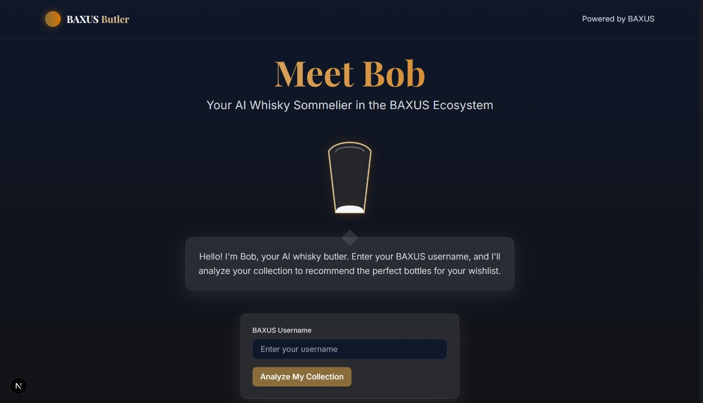

# Bob - Your AI Whisky Sommelier

Bob is an AI-powered whisky recommendation engine built for the BAXUS ecosystem. It analyzes users' whisky collections and provides personalized bottle recommendations based on taste preferences, collection diversity, and other factors.



## Features

- **Personalized Recommendations**: Bob analyzes your whisky collection and recommends bottles that match your taste profile using GPT-powered analysis.
- **Collection Visualization**: View your whisky collection with detailed information about each bottle.
- **Taste Profile Analysis**: Get insights into your whisky preferences based on your collection.
- **BAXUS Integration**: Seamlessly connects with your BAXUS whisky collection.
- **Animated Beer Glass Interface**: A sleek beer glass animation that fills with whisky during loading.

## Getting Started

### Prerequisites

- Node.js 16.x or later
- npm or yarn
- Supabase account (for database)
- OpenAI API key (for recommendation engine)

### Installation

1. Clone the repository:
```bash
git clone https://github.com/yourusername/bob.git
cd bob
```

2. Install dependencies:
```bash
npm install
# or
yarn install
```

3. Create a `.env.local` file in the root directory with the following variables:
```
NEXT_PUBLIC_SUPABASE_URL=your_supabase_url
NEXT_PUBLIC_SUPABASE_ANON_KEY=your_supabase_anon_key
OPENAI_API_KEY=your_openai_api_key
```

4. Run the development server:
```bash
npm run dev
# or
yarn dev
```

5. Open [http://localhost:3000](http://localhost:3000) with your browser to see the result.

## Tech Stack

- **Frontend**: Next.js, React, TypeScript
- **UI**: Tailwind CSS, Framer Motion
- **State Management**: React Query
- **API**: Axios for API requests
- **AI Integration**: OpenAI GPT for intelligent whisky recommendations
- **Database**: Supabase for storing bottle information
- **Styling**: Custom Tailwind theme with glass morphism effects and animated beer glass UI

## How It Works

1. **User Authentication**: Users enter their BAXUS username to access their collection.
2. **Collection Analysis**: Bob analyzes the user's whisky collection to understand preferences.
3. **Loading Visualization**: Watch as the beer glass fills with whisky while Bob analyzes your collection.
4. **AI Recommendation Engine**: Using GPT, Bob analyzes the collection and provides personalized recommendations.
5. **Display Results**: Recommendations are displayed in an interactive card deck with detailed explanations.

## Features in Detail

### Collection Analysis

Bob analyzes various aspects of your collection:
- Region distribution
- Distiller preferences
- Whisky types
- Price ranges
- Flavor profile (sweet, fruity, smoky, peaty, etc.)

### Recommendation Logic

Recommendations are generated based on:
- Similarity to existing bottles
- Value for money compared to your spending habits
- Trending bottles in the whisky community
- Complementary flavors to diversify the collection

### Bob's Personality

Bob has a distinct personality as an AI whisky sommelier, with:
- Animated beer glass avatar that fills during analysis
- Bubble animations and whisky filling effects
- Typing animation for responses
- Thoughtful analysis of your collection
- Detailed explanations for recommendations

## API Integration

The application integrates with:
- BAXUS API to fetch user collections
- OpenAI GPT for intelligent recommendations
- Supabase for bottle database management

## Project Structure

```
├── components             # React components
│   ├── bar                # Bar visualization components
│   ├── bob                # Bob avatar and dialog components
│   ├── layout             # Layout components
│   ├── recommendations    # Recommendation components
│   └── ui                 # UI components (Button, Card, etc.)
├── hooks                  # Custom React hooks
├── pages                  # Next.js pages
│   ├── api                # API routes
│   └── index.tsx          # Main page
├── services               # Service layer for API calls
├── styles                 # Global styles
├── types                  # TypeScript type definitions
└── utils                  # Utility functions
```

## Database Setup

For the application to work correctly, you need to:
1. Set up a Supabase project with proper policies
2. Enable read access to your bottles table using Row Level Security
3. Use the fallback recommendation system if no bottles exist in the database

## Contributing

Contributions are welcome! Please feel free to submit a Pull Request.

## License

This project is licensed under the MIT License - see the LICENSE file for details.

## Acknowledgements

- [BAXUS](https://baxus.co) for the whisky collection API
- [OpenAI](https://openai.com) for the GPT API
- [Tailwind CSS](https://tailwindcss.com) for the styling framework
- [Framer Motion](https://www.framer.com/motion/) for animations
- [Next.js](https://nextjs.org) for the React framework
- [Vercel](https://vercel.com) for hosting
- [Supabase](https://supabase.io) for database services